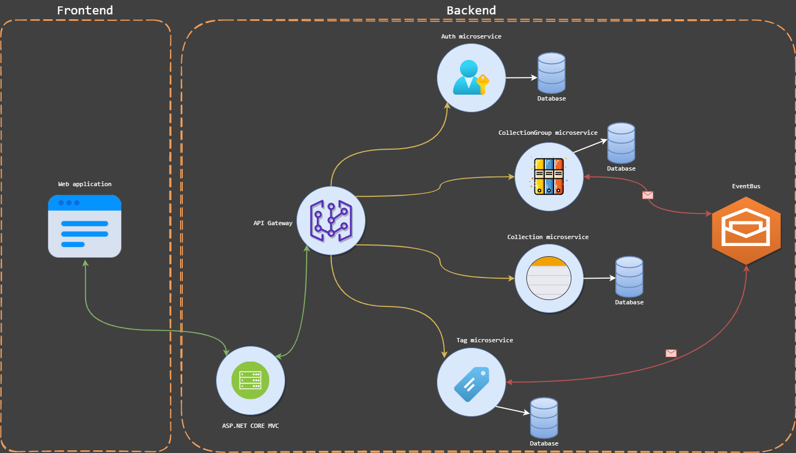
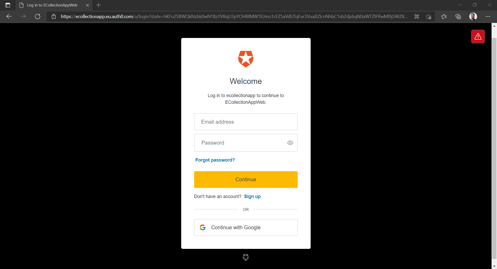
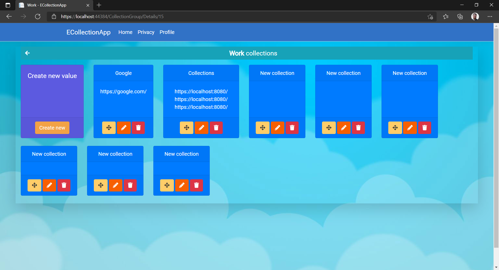
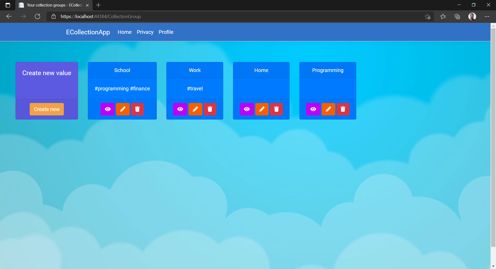

# ECollectionApp

ASP.NET Core Web application with microservices architecture. It keeps your collections like links, quotes, snippets or any other text-based resource you collect while doing research or any other activity that makes you want to keep these in one place.

## 🏗️ Architecture

Tech stack:
- .NET 5
- ASP.NET Core MVC
- WEB API (ASP.NET Core)
- Entity Framework Core
- SQL Server
- MassTransit + RabbitMq
- Ocelot
- Auth0
- JWT Tokens

## 👀 Demonstration

## 💡 Proof of concept

The goal of this project is to apply and demonstrate microservice architecture in relatively small area as collecting text-based resources. There are many areas to improve, but I want to keep it simple to show how microservices architecture can be applied in this case.

Only local hosting was used there for simplicity. Auth0 was used for authentication and JWT tokens were used for authorization. Auth0 is a cloud service that provides a single sign-on solution for your applications and is described here as Auth microservice. Frontend is pretty basic and its goal was not to provide a full-featured frontend for the backend.

## 🤝 Contributing

You can freely contribute with us by reporting issues and making pull requests!
Please read [CONTRIBUTING.md](https://github.com/Prastiwar/ECollectionApp/blob/master/.github/CONTRIBUTING.md) for details on contributing.

## 📘 License

This project is licensed under the MIT License - see the [LICENSE.md](https://github.com/Prastiwar/ECollectionApp/blob/master/LICENSE) file for details.
